# Data Science Portfolio

### Aim: 
The aim of portfolio is to represent my accomplishment with Data Science technique and how it benefited the business models, exhibiting the difference in the business model before and after implementing these techniques. 

 
# Business Case Studies:
## Claim Denial Prediction:
* Problem statement:In healthcare  billing system there are at least 10% claims gets denied for verious reason. The affort to appeal and reverse those claims costs time and money and in many cases the appeals time limit excesseds and billing company has to bare losses. But if we get to know which claim is going to deny and which will be paid billing company will have plan of action prior to denial of the claim and hence can save the losses due to denials.

## Authorization Request approval request prediction:
* Problem statement: In US heatlhcare system before performing/recommending any high-tech radiology exam such as Mri,Ct Scan, Pet Scans etc doctors must optain permission(Pre-Authorization) before performing it. 
1. This pre-authorization are given by the patients health insurance or by the tpa's which are hired by the heath insurance based on the medical necessity.
2. One of the largest tpa is Carecore and it utilizes an AI to determine whether authorization is to be given or not based on the information submitted to them by the doctors.
3. About 5000 to 8000 pre-authorization requestes are filed by us and only 60% of those are approved instanously and the rest are moved to review by medical prefessionals of Carecore. 
4. As per the business need it is necessary to determine which of the 60% will be approved in order to maintain or schedule appointments of the patients. That means we need to predict which of the authorization request will approve. 

* Attributes and its description:

1. target:- The target value is '0' and '1' means approval and denial of a pre-authorization request filed to a Health Insurance or to its TPA who works behalf of the patients health insurance. 
2. clean_mod :- It represents a modification to the medical service given to the patient example: MRI needs to be performed by focusing a perticular body part.
3. gender : It represents the gender of the patient. 
4. Insurance_type:- It represents whether the health insurance is primary or secondary.
5. prefix:- It represents prefix attached to health insurance member ids.
6. actual_ins :- Patients health insurance name.
7. Ins_class :- It represent whether the patients health insurance is Non-financial or financial origanization.
8. cpt_description :- It represents the name of the medical procedure. 
9. icd_description :- It the diseases of the patient diagnosed by a doctor. 
10. pat_age : Patients age in days.
11. Pre-auth/CAPP-Model_gitcopy.ipynb

* EDA
Class distribution: 

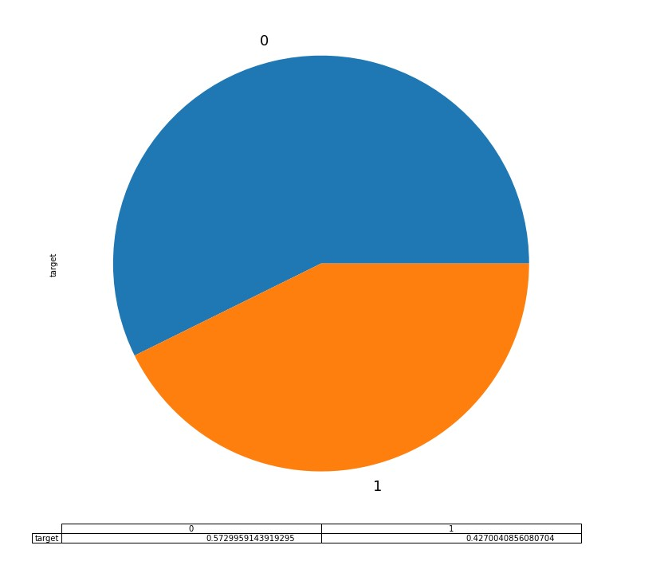

* Application ML/Deep Learning Techniques:

1. Create a baseline model as shown below. Hence, we can compare the performance of each ML/Deep Learning techniques with it. It is achieved by generating random numbers equal to the number of classes and randomly distribute it accross the length of the data.
Reference: https://stackoverflow.com/questions/18659858/generating-a-list-of-random-numbers-summing-to-1/18662466#18662466

Class report of Baseline model shows 0.50 recall and precision:

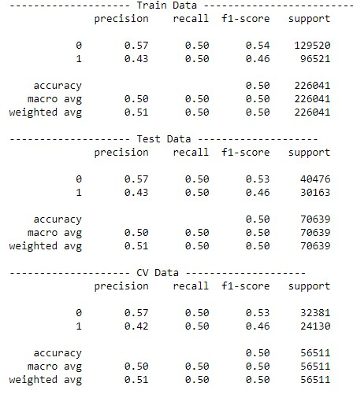

2. AUC of all algorithms:

a. Navie Bayes-AUC Curve:

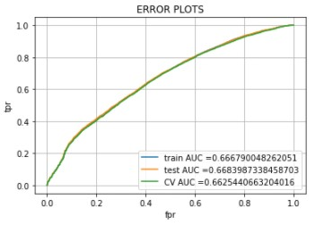

b. Logistic Regression-AUC Curve:

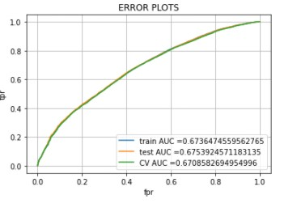

c. SVM-AUC Curve:

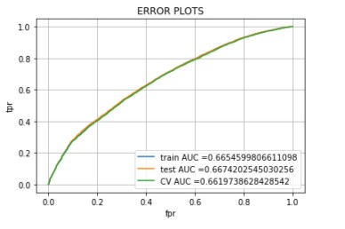

d. Decision Tree-AUC Curve:

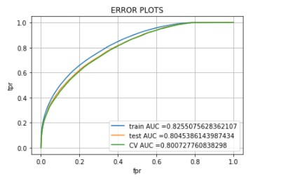

e. Random Forest - AUC Curve

f. Catboost - AUC Curve

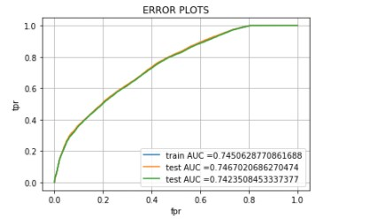

g. Adaboost - AUC Curve

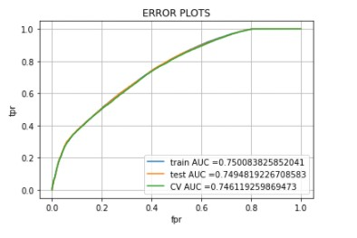

h. light_xgb-AUC Curve

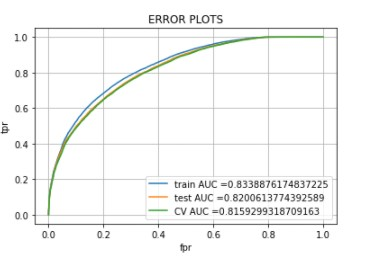

i. XGBoost - AUC Curve

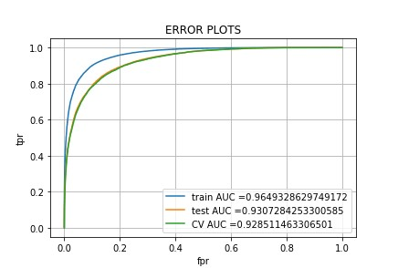

j. Multilayered percepton -AUC Curve

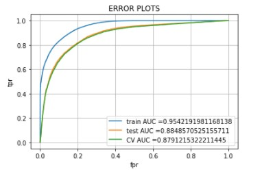

3. Performance Comparison after applying ML/DL techniques:

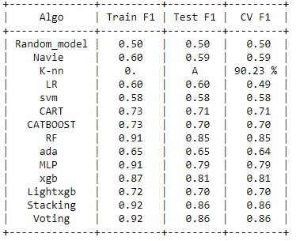

* XGB AUC 

* XGB Class Report and LogLoss:

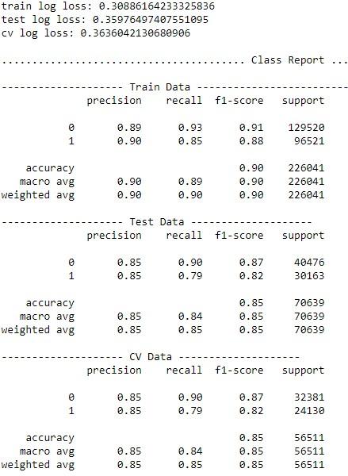

4. Conclusion: 

Based on the scores in XGB scores are more consistant with F1 scores among the Train, Test and sc and another model is Random forest which also close to XGB scores.

XGB is best for deployment. 

[Please refer the ipython notebook](https://github.com/omshri29/Data-Science-Portfolio/blob/a2f957b258d9f5494772319f7f0556cc9db1309e/TPA/TPA%20models%20with%20master%20payor%20and%20original%20payor%20name.ipynb)

## BitCoin Price Forcasting:
## Project name: Clear TPA

* Problem Statement: Find/Predict TPA(class) based on historical data. Inn pre-authorization business, healthcare doctors need to get pre-authorization/permission before performing certain medical services such as Mri, Ct scan, PET scan etc from a TPA chosen by patients’ health insurance. 
  Agents who are working on behalf of doctors have to call the health insurance companies to find out how is the tpa for pre-authorization and then they call the tpa to place pre-authorization request. In this process, agents spent at least 10 mins per pre-authorization request to find out which tpa to call. But if we can find out which tpa to call, then it can significantly improve labour hours by 10 mins for each agent where there are 150 agents works . 

* Application ML/Deep Learning Techniques:

First, we decide the parameter to measure, since it is a classification problem and we have to predict multiple classes, the optimum matric would be Logloss, F1 macro Scores keeping in mind accuracy paradox. 
1. Create a baseline model as shown below. Hence, we can compare the performance of each ML/Deep Learning techniques with it. It is achieved by generating random numbers equal to the number of classes and randomly distribute it accross the length of the data.
Reference: https://stackoverflow.com/questions/18659858/generating-a-list-of-random-numbers-summing-to-1/18662466#18662466

2. Class Distribution:
This indicates classes are highly imbalanced

3. After creating models with below following ML/DL techniques will compare the score and select the highest performing model.
   * Random model
   * Knn
   * Navie Bayes
   * Linear Regression with and without class balance
   * SVM
   * Random Forest
   * Decision Tree(CART)
   * XGBOOST
   * Multilayered perceptron(MLP)
   * Catboost and other (adaboost,discriminant,stackingclassifier,voterclassifier are optional if performance required improvement)

[Please refer the ipython notebook](https://github.com/omshri29/Data-Science-Portfolio/blob/a2f957b258d9f5494772319f7f0556cc9db1309e/TPA/TPA%20models%20with%20master%20payor%20and%20original%20payor%20name.ipynb)

4. Performance Comparison:

5. **Conclusion:**

Based on the F1 scores, it is clear that the Catboost technique has given better output such as the the fluctuation between scores of train, test and cv is less which implace less overfit and Catboost has the highest score.  

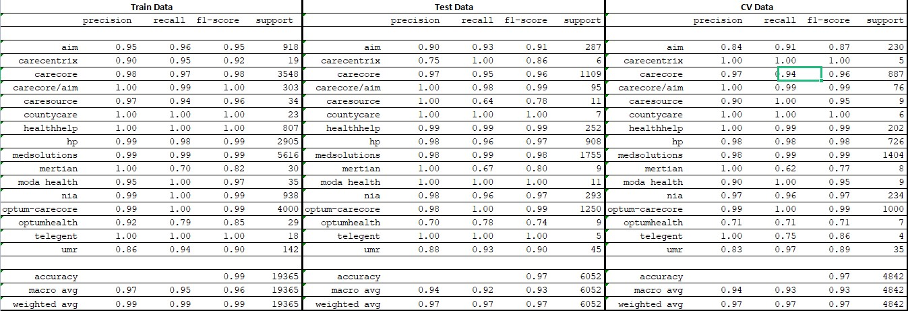
