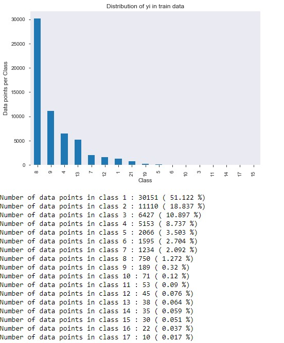
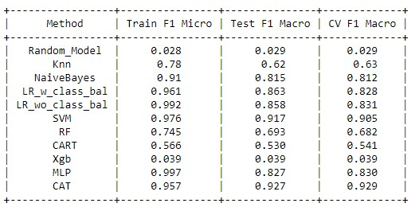

# Data Science Portfolio

### Aim: 
The aim of portfolio is to represent my accomplishment with Data Science technique and how it benefited the business models, exhibiting the difference in the business model before and after implementing these techniques. 

 
### Business Case Studies:
## Project name: Clear TPA

* Problem Statement: Find/Predict TPA(class) based on historical data. In pre-authorization business, healthcare doctors need to get pre-authorization/permission before performing certain medical services such as Mri, Ct scan, PET scan etc from a TPA chosen by patients’ health insurance.
* Agents who are working on behalf of doctors have to call the health insurance companies to find out how is the tpa for pre-authorization and then they call the tpa to place pre-authorization request. In this process, agents spent at least 10 mins per pre-authorization request to find out which tpa to call. But if we can find out which tpa to call, then it can significantly improve labour hours by 10 mins for each agent where there are 150 agents works . 

* Application ML/Deep Learning Techniques:

First, we decide the parameter to measure, since it is a classification problem and we have to predict multiple classes, the optimum matric would be Logloss, F1 macro Scores keeping in mind accuracy paradox. 
1. Create a baseline model as shown below. Hence, we can compare the performance of each ML/Deep Learning techniques with it. 

2. Class Distribution:

3. After creating models with below following ML/DL techniques will compare the score and select the highest performing model.
   * Random model
   * Knn
   * Navie Bayes
   * Linear Regression with and without class balance
   * SVM
   * Random Forest
   * Decision Tree(CART)
   * XGBOOST
   * Multilayered perceptron(MLP)
   * Catboost and other (adaboost,discriminant,stackingclassifier,voterclassifier are optional if performance required improvement)

[refer ipython notebook](https://github.com/omshri29/Data-Science-Portfolio/blob/a2f957b258d9f5494772319f7f0556cc9db1309e/TPA/TPA%20models%20with%20master%20payor%20and%20original%20payor%20name.ipynb)

**Performance Comparison:** 

